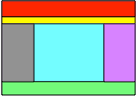
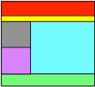
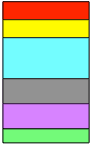
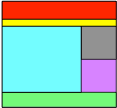
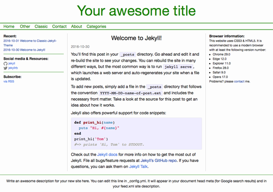

# classic-jekyll-theme

Welcome to Classic-Jekyll-Theme. This theme centers around one of the most used website structures on the web. A banner, navigation menu, (up to) three columns and a footer. The design is fully responsive for three different screen widths: wide, medium and narrow. It is probably best shown in an example:

Wide:



Medium:



Narrow:



The columns are called Primary (blue), Secondary (grey) and Tertiary (pink). In the above layouts the secondary column is on the left side. If it had been on the right side, the medium layout would have looked like this:



The menu bar (in yellow) is always deployed in the wide layout. In the medium and narrow layout the menu bar is shown in the deployed state. When not deployed, a menu-item symbol is shown in the banner that switches the menu between deployed and not.

An example screenshot:



The navigation bar is created automatically from the available pages when they have the proper YAML frontmatter. The navigation bar contains the top level menu items, while the submenu items show up as a drop-down menu when the cursor hovers over the corresponding menu item.

Category pages are created semi-automatically; the web designer has to identify the categories for inclusion, but the menu entry and category pages are created automatically.

For european users a cookies policy is included by default. It can be easily disabled for non-european websites though.

## Installation

Add this line to your Jekyll site's Gemfile:

```ruby
gem "classic-jekyll-theme"
```

And add this line to your Jekyll site's `_config.yml`:

```yaml
theme: classic-jekyll-theme
```

And then execute:

    $ bundle

Or install it yourself as:

    $ gem install classic-jekyll-theme

## Usage

The theme is configured in `_config.yml` and `_sass/classic-jekyll-theme.scss`.

### _config.yml

The following values are configurable:

- secondary_column:

	Controls the placing of the secondary column on either the `left` side, the `right` side or `none` at all.

	When the secondary column is present its contents is taken from the file: `_includes/secondary-column.html`

- tertiary_column:

	Controls the presence of the tertiary column, either `present` or `none`.

	When the tertiary column is present its contents is taken from the file: `_includes/tertiary-column.html`

- number-of-posts-on-home-page:

	By default set to 5, thus 5 posts will be shown in full on the home page.
	
- number-of-recent-posts-in-widget:

	The number of posts (titles) that will appear in the "Recent" widget.

- enable-cookies-policy:
 
	`yes` to enable the cookies warning, `no` to disable. This is the cookies warning from [Silktide](http://silktide.com/cookieconsent) distributed under the MIT license.


### _sass/classic-jekyll-theme.scss

The default `main.scss` file has been emptied. Hence all CSS configuration is done in the theme sass file.

## Feedback

Comments, bug reports, feature requests and improvements are eagerly anticipated via email: rien@balancingrock.nl.

## License

The theme is available as open source under the terms of the [MIT License](http://opensource.org/licenses/MIT).

